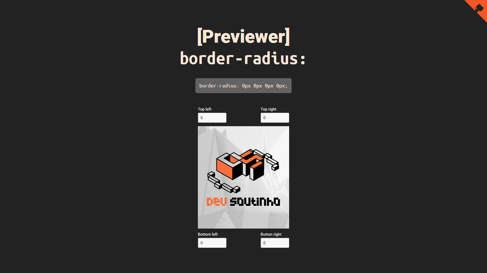

# 



## ✨ Tecnologias

- [Vite](https://vitejs.dev/)
- [Typescript](https://www.typescriptlang.org/)
- [Eslint](https://eslint.org/)
- [Prettier](https://prettier.io/)
- [React](https://reactjs.org/)
- [Styled Components](https://styled-components.com/)
- [React Toastify](https://github.com/fkhadra/react-toastify)

## 🧑‍💻 Como executar

Clone o projeto e acesse sua pasta

```bash
$ git clone https://github.com/wendson13/dev-soutinho-challenge-001
$ cd dev-soutinho-challenge-001
```

Instale as dependências e execute o projeto com yarn ou npm

```bash
# instalar dependências
$ yarn
  ou
$ npm i

# executar o projeto
$ yarn dev
  ou
$ npm run dev
```

acesse o projeto em [localhost:3000](http://localhost:3000) em seu navegador.

## 📌 Layout

layout usado no projeto no link abaixo

- [layout web](https://www.figma.com/file/b41oNs9Pmuz1MFWKH79zfa/%23001---CSS-Preview%3A-Border-Radius?node-id=0%3A1)

## ©️ Creditos

Desafio por:

- [Dev Soutinho](https://devsoutinho.notion.site/CSS-Preview-Border-Radius-DevSoutinhoChallenges-14fd017db675495b81ce5cd5f68981f0)

## 📝 License

Esse projeto está sob a licença MIT. Veja [LICENSE](LICENSE) para mais detalhes.
